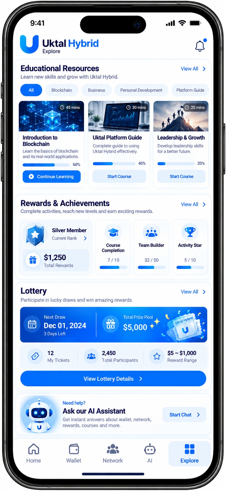

# 🚀 OUKTAL — Uktalhybird

<p align="center">

**AI-Integrated Hybrid Platform with Blockchain-Based Transactions**

A modern hybrid digital platform combining educational resources, AI-powered assistance, reward-oriented platform modules, referral and networking features, and blockchain-based deposit and withdrawal functionality.

</p>

---

## 📌 About OUKTAL

**OUKTAL (Uktalhybird)** is a modern hybrid digital platform designed around a combination of educational content, AI-powered features, networking and referral mechanisms, reward-oriented systems, and blockchain technology.

The platform is designed to provide users with a centralized environment where they can access educational resources, interact with an integrated AI chatbot, participate in platform activities, manage their account and wallet, and use blockchain-based functionality for deposits and withdrawals.

The project brings together several technologies and platform concepts into a single ecosystem, with a strong focus on automation, digital accessibility, user interaction, and modern financial technology infrastructure.

---

## ✨ Key Features

### 🤖 AI Integration

OUKTAL includes **Artificial Intelligence (AI)** as an integrated part of the platform.

The AI layer is designed to enhance the user experience by providing intelligent assistance and making information and platform interaction easier for users.

Potential AI-powered functionality includes:

* AI-assisted user interaction
* Intelligent information assistance
* Educational assistance
* Automated responses
* AI-powered guidance
* Intelligent chatbot interaction
* Future AI-driven platform enhancements

---

## 💬 AI Chatbot

One of the major features of the platform is the integrated **AI Chatbot**.

The chatbot provides users with an interactive way to communicate with the platform's AI system.

### Chatbot Capabilities

The AI chatbot can be used as an intelligent assistance layer for:

* Answering user questions
* Providing platform-related guidance
* Assisting with educational information
* Explaining platform functionality
* Helping users understand available features
* Providing conversational assistance
* Improving overall user engagement

The chatbot architecture can also be extended in the future to support more specialized AI agents and domain-specific assistance.

---

# ⛓️ Blockchain Integration

OUKTAL integrates **blockchain technology** into its transaction infrastructure.

Blockchain functionality is used to support the platform's **deposit and withdrawal workflow**, providing a technology layer for handling digital-asset-related transactions.

### Blockchain Features

* Blockchain-based deposits
* Blockchain-based withdrawals
* Transaction-oriented wallet functionality
* Digital asset transaction processing
* Transaction status handling
* Wallet-related functionality
* Blockchain transaction integration

The blockchain layer is intended to provide a modern and transparent infrastructure for supported platform transactions.

> **Security Note:** Private keys, seed phrases, wallet secrets, API secrets, and other sensitive credentials must never be committed to a public GitHub repository.

---

# 💰 Wallet & Transaction System

The platform includes wallet-oriented functionality for managing user transactions.

The wallet layer is designed to provide users with a centralized view of their platform-related transaction activity.

### Wallet Functionality

* Deposit functionality
* Withdrawal functionality
* Transaction processing
* Transaction status
* Wallet balance management
* Transaction history
* Blockchain transaction integration

The exact transaction behavior depends on the configured blockchain infrastructure and deployment environment.

---

# 📚 Educational Platform

OUKTAL also includes an educational component.

The platform presents educational resources intended to help users understand concepts related to the ecosystem and digital technologies.

Educational areas described by the platform include topics such as:

* Cryptocurrency basics
* Blockchain concepts
* Digital assets
* Platform-related education
* Technology awareness
* AI-related learning
* Digital ecosystem concepts

The educational component can be expanded over time with additional articles, tutorials, videos, courses, and interactive learning material.

---

# 📦 Package System

The platform documentation describes multiple package levels.

The package structure described in the project material includes:

| Package | Described Passive Reward |
| ------- | -----------------------: |
| $5      |                2X / 200% |
| $10     |                2X / 200% |
| $25     |                2X / 200% |
| $50     |                2X / 200% |
| $100    |                3X / 300% |
| $250    |                3X / 300% |
| $500    |                3X / 300% |

These figures represent the reward structure described in the platform material and should not be interpreted as independently verified financial returns.

---

# 📈 Passive Reward System

The platform documentation describes a passive reward mechanism associated with user packages.

According to the project material:

* A portion of the package amount is allocated to the passive pool.
* The passive pool is described as **20% of the package amount**.
* Distributions are described as taking place on the **1st and 15th** of the month.

The exact implementation and eligibility rules depend on the platform's backend logic and deployed configuration.

---

# 🤝 Referral / Direct Income

OUKTAL includes a referral-oriented system.

The platform material describes **direct/referral income of 20%**.

The referral system is designed to allow users to participate in the platform's networking structure through direct referrals.

### Referral Features

* Referral links
* Direct referrals
* Referral tracking
* Team/network structure
* Referral-based rewards
* Networking functionality

---

# 📊 Level Income System

The platform documentation describes a level-based commission system.

According to the project material:

* Total level commission is described as **55%**.
* One direct referral is required per level.
* Additional referrals unlock additional levels.

This structure is intended to provide a hierarchical networking mechanism within the platform.

---

# 🧩 Matrix System

OUKTAL also includes a matrix-oriented module.

The documented structure includes:

* Starting matrix amount: **$10**
* Activation amount: **$11**
* Matrix structure: **1 × 4**
* Multiple matrix levels
* Global placement
* First-come-first-serve placement
* Up to 8 matrices described in the project material

The project material also describes a potential figure of **$7,660** associated with the matrix structure.

These values represent the project's documented model and are not independent financial projections or guarantees.

---

# 🎟️ Lottery System

The platform documentation includes a lottery mechanism.

According to the project material:

* **10%** of the package amount is allocated to the lottery wallet.
* Ticket price: **$1**
* Prize range: **$2–$100**
* Total tickets described: **1,000**
* Lucky draw trigger described at **$6,000**

The lottery functionality is part of the platform's reward-oriented module.

---

# 🏆 Ranks & Rewards

OUKTAL includes a rank and reward structure designed around team and business activity.

The project documentation describes rewards ranging from:

**$100 → $50,000**

Example ranks described include:

* Silver
* Gold
* Ruby
* Diamond

Rank eligibility is described as being associated with team and business criteria.

---

# 💳 Withdrawal System

The platform includes a withdrawal mechanism connected to the wallet and blockchain transaction layer.

The project documentation describes:

* Minimum withdrawal: **$2**
* Withdrawal fee: **10%**
* Daily withdrawal availability
* Withdrawal processing
* Blockchain-based transaction handling

Actual availability and processing depend on the deployed platform configuration and blockchain infrastructure.

---

# 💵 Deposit System

OUKTAL includes blockchain-based deposit functionality.

The deposit workflow is designed to allow supported digital assets to be transferred into the platform through the configured blockchain infrastructure.

### Deposit Flow

```text
User
  │
  ▼
Wallet / Deposit Section
  │
  ▼
Blockchain Transaction
  │
  ▼
Transaction Verification
  │
  ▼
Platform Wallet
  │
  ▼
Updated Balance
```

---

# 🔄 Withdrawal Flow

The withdrawal process follows a blockchain-oriented workflow.

```text
User
  │
  ▼
Withdrawal Request
  │
  ▼
Wallet Validation
  │
  ▼
Transaction Processing
  │
  ▼
Blockchain Network
  │
  ▼
Transaction Confirmation
  │
  ▼
User Wallet
```

---

# 🧠 AI + Blockchain Architecture

One of the main characteristics of OUKTAL is the combination of **AI technology and blockchain functionality**.

A simplified conceptual architecture can be represented as:

```text
                    ┌─────────────────────┐
                    │      OUKTAL         │
                    │    Web / Mobile     │
                    │      Platform       │
                    └──────────┬──────────┘
                               │
              ┌────────────────┼────────────────┐
              │                │                │
              ▼                ▼                ▼
       ┌─────────────┐  ┌─────────────┐  ┌─────────────┐
       │ AI Layer    │  │ User System │  │ Wallet      │
       │             │  │             │  │ System      │
       └──────┬──────┘  └─────────────┘  └──────┬──────┘
              │                                  │
              ▼                                  ▼
       ┌─────────────┐                   ┌─────────────┐
       │ AI Chatbot  │                   │ Blockchain  │
       │             │                   │ Integration │
       └─────────────┘                   └──────┬──────┘
                                                │
                                                ▼
                                       ┌────────────────┐
                                       │ Deposit /      │
                                       │ Withdrawal     │
                                       └────────────────┘
```

---

# 🏗️ Platform Modules

The project can be logically divided into several major modules.

### 👤 User Management

Responsible for user-oriented functionality such as:

* Registration
* Login
* User profile
* Account information
* User dashboard
* Authentication

### 🤖 AI Module

Responsible for:

* AI chatbot
* AI assistance
* Intelligent responses
* Educational assistance
* Future AI automation

### 💰 Wallet Module

Responsible for:

* Balance
* Deposits
* Withdrawals
* Transactions
* Wallet activity

### ⛓️ Blockchain Module

Responsible for:

* Blockchain communication
* Transaction processing
* Deposit verification
* Withdrawal processing
* Transaction status

### 🤝 Referral Module

Responsible for:

* Referral links
* Direct referrals
* Team tracking
* Referral rewards

### 📊 Level Module

Responsible for:

* Level progression
* Level-based rewards
* Team structure
* Commission calculation

### 🧩 Matrix Module

Responsible for:

* Matrix placement
* Matrix levels
* Matrix activity
* Matrix rewards

### 🏆 Rank Module

Responsible for:

* Rank progression
* Team criteria
* Business criteria
* Reward tracking

### 🎟️ Lottery Module

Responsible for:

* Lottery wallet
* Ticket management
* Lucky draw
* Prize handling

---

# 📱 User Experience

The platform is designed around a centralized user experience where users can access different platform modules from their dashboard.

A typical user journey can be represented as:

```text
Registration / Login
        │
        ▼
   User Dashboard
        │
 ┌──────┼────────┬──────────┐
 ▼      ▼        ▼          ▼
AI     Wallet   Referral   Education
 │       │        │          │
 ▼       ▼        ▼          ▼
Chat   Deposit   Team      Learning
       Withdraw  Network    Content
        │
        ▼
   Blockchain
```

---

# 🔐 Security

Security is a critical part of any platform involving authentication, AI services, wallets, and blockchain transactions.

### Security Principles

* Never expose private keys.
* Never expose wallet seed phrases.
* Never commit secret API keys.
* Never commit production passwords.
* Use environment variables for sensitive configuration.
* Keep production credentials outside source control.
* Validate transaction requests.
* Validate user authentication.
* Implement server-side authorization.
* Verify blockchain transactions before crediting balances.
* Maintain appropriate transaction logs.
* Protect administrative endpoints.

### GitHub Security

Before publishing the project, check that the repository does not contain:

```text
.env
.env.production
private keys
seed phrases
wallet credentials
API secrets
database passwords
service account credentials
production certificates
```

---

# ⚙️ Technology Stack

The exact technology stack depends on the implementation of the current project, but the platform architecture includes the following technology areas:

| Technology       | Purpose                               |
| ---------------- | ------------------------------------- |
| AI               | Intelligent assistance and chatbot    |
| AI Chatbot       | Conversational user interaction       |
| Blockchain       | Deposit and withdrawal infrastructure |
| Wallet System    | Transaction and balance management    |
| Backend Services | Business logic and platform APIs      |
| Database         | User and platform data                |
| Git              | Version control                       |
| GitHub           | Source code hosting                   |

---

# 📂 Recommended Project Structure

A scalable project structure can be organized around independent modules:

```text
OUKTAL/
│
├── android/
├── ios/
├── web/
│
├── lib/
│   │
│   ├── ai/
│   │   ├── chatbot/
│   │   ├── ai_service/
│   │   └── ai_models/
│   │
│   ├── blockchain/
│   │   ├── deposit/
│   │   ├── withdrawal/
│   │   ├── wallet/
│   │   └── transaction/
│   │
│   ├── authentication/
│   ├── dashboard/
│   ├── education/
│   ├── referral/
│   ├── level/
│   ├── matrix/
│   ├── lottery/
│   ├── rewards/
│   ├── ranks/
│   └── profile/
│
├── assets/
│
├── test/
│
├── .gitignore
├── pubspec.yaml
└── README.md
```

> The actual directory structure should be updated to match the project's implementation before using this section as technical documentation.

---

# 🚀 Getting Started

## Prerequisites

Before running the project, make sure the required development environment is installed.

Depending on the project implementation, this may include:

* Flutter SDK
* Dart SDK
* Android Studio
* VS Code
* Git
* Blockchain wallet/network configuration
* AI service configuration
* Backend services
* Database configuration

Check the development environment:

```bash
flutter doctor
```

---

# 📥 Installation

Clone the repository:

```bash
git clone https://github.com/YOUR-USERNAME/Uktalhybird.git
```

Navigate to the project:

```bash
cd Uktalhybird
```

Install dependencies:

```bash
flutter pub get
```

Run the application:

```bash
flutter run
```

---

# 🔧 Configuration

Before running the complete application, configure the required services.

Depending on the implementation, configuration may include:

```text
AI API
Blockchain Network
Wallet Configuration
Backend API
Database
Authentication
Environment Variables
```

Sensitive values should be stored securely using environment configuration rather than hard-coded into source files.

---

# 🤖 AI Configuration

The AI module requires the appropriate AI service configuration.

A production deployment should keep AI credentials on a secure backend or protected environment rather than exposing secret keys inside the client application.

Conceptually:

```text
Application
     │
     ▼
Secure Backend
     │
     ▼
AI Service
     │
     ▼
AI Response
     │
     ▼
Application
```

---

# ⛓️ Blockchain Configuration

Blockchain functionality requires the appropriate network and wallet configuration.

Depending on the deployed blockchain infrastructure, configuration may include:

* Network / chain information
* RPC endpoint
* Wallet address
* Token contract information
* Transaction configuration
* Confirmation requirements
* Backend verification
* Gas/transaction settings

Production private keys must never be stored in the public repository.

---

# 🧪 Testing

Testing should cover the main platform modules before production deployment.

Recommended testing areas include:

### Authentication

* Registration
* Login
* Logout
* Session handling

### AI

* Chat requests
* AI responses
* Error handling
* Invalid requests

### Blockchain

* Deposit requests
* Transaction verification
* Withdrawal requests
* Failed transactions
* Transaction confirmation

### Wallet

* Balance updates
* Transaction history
* Deposit status
* Withdrawal status

### Referral

* Referral registration
* Direct referral tracking
* Team calculations

### Platform Logic

* Package handling
* Level calculations
* Matrix placement
* Rewards
* Rank progression
* Lottery functionality

---

# 📊 Platform Workflow

A high-level platform workflow can be represented as:

```text
                    ┌───────────────┐
                    │     User      │
                    └───────┬───────┘
                            │
                            ▼
                    ┌───────────────┐
                    │ Authentication│
                    └───────┬───────┘
                            │
                            ▼
                    ┌───────────────┐
                    │   Dashboard   │
                    └───────┬───────┘
                            │
       ┌────────────────────┼────────────────────┐
       │                    │                    │
       ▼                    ▼                    ▼
  ┌─────────┐         ┌──────────┐        ┌───────────┐
  │   AI    │         │  Wallet  │        │ Networking│
  └────┬────┘         └────┬─────┘        └─────┬─────┘
       │                   │                    │
       ▼                   ▼                    ▼
   Chatbot           Blockchain             Referral
                       │                    / Matrix
                       │
                 ┌─────┴─────┐
                 ▼           ▼
              Deposit    Withdrawal
```

---

# 🌟 Project Highlights

OUKTAL demonstrates the integration of several modern technology concepts within a single platform:

* 🤖 Artificial Intelligence
* 💬 AI Chatbot
* ⛓️ Blockchain Technology
* 💰 Digital Wallet
* 🔄 Blockchain Transactions
* 📚 Educational Content
* 🤝 Referral System
* 📊 Level-Based System
* 🧩 Matrix System
* 🎟️ Lottery Module
* 🏆 Rank & Reward System
* 👤 User Management
* 🔐 Security-Oriented Architecture

---

# 🔮 Future Scope

The architecture can be extended with additional functionality in future releases.

Potential improvements include:

### AI

* Advanced AI agents
* Personalized AI assistance
* AI-powered recommendations
* Voice-based AI interaction
* Multilingual chatbot
* AI learning assistant

### Blockchain

* Additional blockchain networks
* More token support
* Advanced transaction monitoring
* Improved transaction verification
* On-chain analytics
* Blockchain explorer integration

### Platform

* Advanced analytics dashboard
* Improved notification system
* Mobile optimization
* Advanced reporting
* Multi-language support
* Enhanced administrative dashboard

### Security

* Two-factor authentication
* Advanced transaction monitoring
* Risk detection
* Improved access control
* Security audit integration

---

# 📸 Screenshots

Screenshots can be added here to demonstrate the application's user interface.

Recommended screenshots:

```text
screenshots/
│
├── login.png
├── dashboard.png
├── ai-chatbot.png
├── education.png
├── wallet.png
├── deposit.png
├── withdrawal.png
├── blockchain-transaction.png
├── referral.png
├── matrix.png
├── rewards.png
└── profile.png
```

Example Markdown:

```markdown

```

---

# 📝 Documentation Note

Some platform values and reward structures documented in this README are based on the project's provided platform material.

For example, package values, passive reward percentages, referral percentages, level percentages, matrix figures, lottery values, and rank rewards represent the documented platform model.

They should be treated as **platform documentation/claims rather than independently verified financial guarantees or investment advice**.

---

# ⚠️ Disclaimer

OUKTAL is a software and technology project incorporating AI, blockchain, educational, wallet, networking, and reward-oriented platform functionality.

Users and developers should independently verify the applicable technical, financial, legal, regulatory, and compliance requirements before deploying or using the platform in any jurisdiction.

Blockchain transactions may be irreversible. Users should carefully verify wallet addresses, networks, transaction details, and supported assets before submitting transactions.

The platform documentation should not be interpreted as a guarantee of financial returns.

---

# 👨‍💻 Development

This project is maintained as a modern digital platform with an emphasis on:

```text
AI
Blockchain
Automation
User Experience
Digital Education
Networking
Transaction Infrastructure
```

Development should follow secure software-development practices, proper version control, environment-based configuration, testing, and responsible handling of user and transaction data.

---

# 🤝 Contributing

Contributions can help improve the project.

A typical contribution workflow:

```bash
git clone <repository-url>

cd Uktalhybird

git checkout -b feature/your-feature

# Make your changes

git add .

git commit -m "Add your feature"

git push origin feature/your-feature
```

Then create a Pull Request on GitHub.

---

# 📄 License

The licensing terms for this project should be defined by the project owner.

If the project is intended for private or proprietary use, do not add an open-source license without confirming the intended licensing model.

---

# ⭐ OUKTAL

**OUKTAL / Uktalhybird** brings together:

> **Artificial Intelligence + AI Chatbot + Blockchain + Wallet Infrastructure + Education + Networking**

into a unified digital platform.
## 📱 UI Preview

### Home Dashboard


### AI Chatbot


### Deposit & Wallet


### Network


### Network Details

---

<p align="center">

**Built with modern technology and a focus on AI-powered and blockchain-enabled digital experiences.**

</p>
